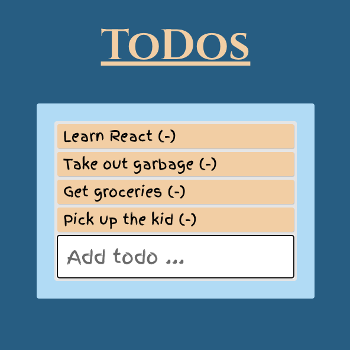

# Product Description
## React application: Todo list with Add/Remove features

# Usage 
<li>Clone repo into Code Editor</li>
<li>Open Terminal</li>
<li>run 'npx http-server' for temporary server</li>
<li>Or can run with "Live Server" extension in VS Code</li>

# Aknowledgments
## Code done during MIT xPro tutorial with Abel Sanchez, Mod. 14
## Styling done with MIT, some done by myself 

# License
## MIT License
